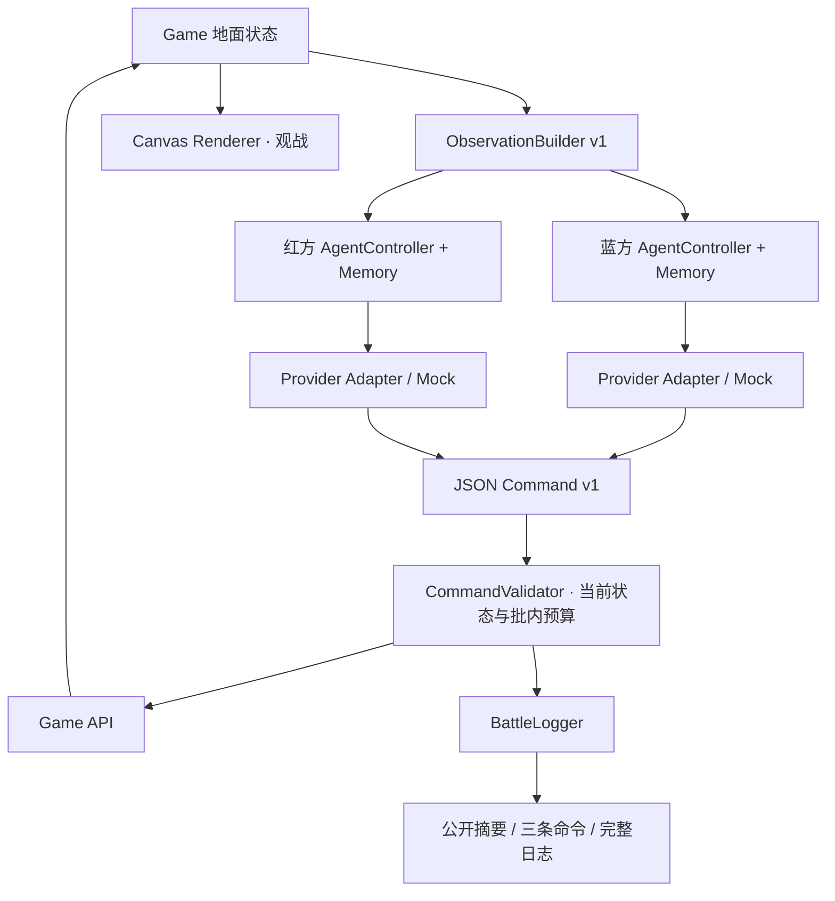

# 奇境王冠 · EVA AI Arena

本阶段在 `feature/eva-ai-arena` 独立分支上增加 AI 对战模式。普通游戏和 UI 稳定版本仍保留在 `UI` 分支。双方 URL、密钥、模型由玩家在游戏内输入。框架开发先使用 Mock/fixtures，随后用户提供外部凭据并授权真实 API 验收，结果见本文末尾。

## 启动与使用

无需安装运行依赖；在此分支工作区执行：

```powershell
python tools/eva_server.py --port 8772
```

打开 `http://127.0.0.1:8772/index.html`。首页保留两种普通地图，另有“进入 EVA”。默认蓝方 Aggressive Mock、红方 Defensive Mock，直接开始即可观看自动对战。默认无限时长，可改为三分钟或五分钟。无限时长示例比赛可能需要较长时间，四种单位/城墙/经济的原数值保持不变。

真实服务的使用顺序：

1. 双方分别选择 Provider，填写 API 的 Base URL（含 `/v1` 或 Gemini 的 `/v1beta`，不含最终 `/chat/completions` 等接口路径）。
2. 输入各自的 API Key。兼容/本地服务允许空 Key，其他服务要求输入。
3. 获取模型列表，选择或手动输入模型 ID。`/models` 不存在时仍可手动输入。
4. 选择支持的推理强度，或使用 Auto。模型能力未知时保持 Auto；兼容服务可在“请求选项”明确选择 `reasoning_effort` 协议。
5. 测试双方当前配置的连接。测试会发送一次短的文本模型请求；没有通过测试的非 Mock 配置不能开始比赛。
6. 开始比赛。普通卡牌作为观战信息保留，EVA 中不接受玩家部署，双方都由 AI 指挥。

模型列表查询失败会显示具体 HTTP 状态、超时、代理未启动、网络/DNS/证书或返回非 JSON 等原因。普通静态服务器不提供 EVA 代理，页面会在发送密钥前给出启动说明；也可按服务的 CORS 支持情况选择直连。列表返回空时不会标记查询成功。

Packy 用户请核对控制台“数据看板”中的 API Endpoint。[官方快速开始](https://docs.packyapi.com/docs/register/#api-端点说明) 当前的 OpenAI 兼容主站示例是 `https://cf.api.fan/v1`。填写 `www.packyapi.ai` / `www.packyapi.com` 时页面显示核对提示，地址由用户自行确认和修改。

默认决策周期三秒，可选 2/3/5/10 秒。“公平周期”同步双方周期；关闭后可分别设置。周期从上一轮完成后算起，网络延迟期间游戏继续。请求选项还可设置 10/20/30/60 秒超时、单次 token 上限、JSON 模式和连接方式。高推理档位可能需要更多 token；输出达到上限时会报告截断错误。

“公平周期”以蓝方周期为准锁定红方，不能抵消双方模型的响应速度差异。“调试面板 · EVA DEBUG”只增加诊断入口，不改变 AI 策略；打开后可查看 Observation、公开回复、解析命令和校验结果，平时观战可关闭。

本地代理与页面同源，解决服务端不允许浏览器 CORS 的情况。服务器仅监听 `127.0.0.1`，验证 Host/Origin、接口路径、请求大小和请求头，不跟随携带凭据的重定向；远端 URL 要求 HTTPS，HTTP 仅允许 loopback 本地模型。它不记录/落盘密钥，也不把上游错误正文回传。普通静态托管仍可用 Mock；真实 API 可选“浏览器直连”，但服务必须允许 CORS。Python 代理不是静态托管平台可自动运行的服务。

## 文件与职责

| 文件 | 职责 |
|---|---|
| `index.html` | 原 Game 战斗、EVA 状态读取/校验执行桥、持久路线命令、普通模式隔离 |
| `js/ai/protocol.js` | ObservationBuilder、CommandValidator、AgentMemory、路线转换、版本号 |
| `js/ai/mock-agent.js` | 进攻/防守 Mock，只读取 Observation；走相同 Command 校验接口 |
| `js/ai/provider-adapters.js` | ProviderAdapter 基类与六种文本 API adapter、模型查询、推理能力、脱敏 |
| `js/ai/agent-controller.js` | 单方决策状态机、独立周期、单请求、超时、取消/过期响应、Arena 生命周期 |
| `js/ai/battle-logger.js` | 滚动日志与完整累计统计、未知费用标记 |
| `js/ai/eva-ui.js` | 首页入口、双方配置、侧边观战面板、日志/Debug、异常恢复、结算 |
| `css/eva.css` | EVA 专用淡蓝/淡粉/奶油界面与手机/平板规则 |
| `tools/eva_server.py` | 可选本地 API 代理及公开静态文件服务，无第三方 Python 依赖 |
| `tests/playtest_eva.py` | 浏览器完整比赛、真实 HTTP fixture adapter/异常/交互验收 |
| `tests/playtest_eva_live.py` | 明确授权后使用外部凭据文件，跑实际模型查询、连接与双方决策；不复制/落盘密钥 |
| `docs/eva-command.schema.json` | 可独立使用的 Command v1 JSON Schema |

`css/style.css`、`js/candy-field.js` 的本轮棒棒糖/半卡宽间距在 UI 分支先提交，再作为本分支基线。没有改单位属性表，也没有引入框架。



Canvas、截图、像素、Vision、OCR、DOM 战场结构均不进入 AI 的输入。Playwright 的截图仅用于开发验收。API 调用全部位于 adapters，Game 只处理游戏状态和命令执行。

## Observation v1

每次通过 `ObservationBuilder.build(side, observationId)` 读取底层状态并整理返回：

```json
{
  "schemaVersion": 1,
  "observationId": "match:player:12:obs",
  "tick": 15321,
  "gameTime": 83.6,
  "timeRemaining": null,
  "map": "cross",
  "self": {"side": "blue", "towerHp": 8360, "towerMaxHp": 10000, "coins": 26.5,
    "cooldowns": {"snake": 0, "lion": 1.8, "elephant": 0, "dragon": 4.1, "potion": 0, "burst": 8.3}, "potionArmed": null},
  "enemy": {"side": "red", "towerHp": 7540, "towerMaxHp": 10000, "coins": 18,
    "cooldowns": {"snake": 0, "lion": 0, "elephant": 0, "dragon": 0, "potion": 0, "burst": 0}, "potionArmed": null},
  "units": [{"id": 47, "owner": "enemy", "type": "lion", "lane": "middle", "progress": 0.45,
    "position": {"x": 0.45, "y": 0.5}, "hp": 680, "maxHp": 700, "attack": 20,
    "attackInterval": 0.5, "movementPerSecond": 0.056, "rangeProgress": 0.065,
    "buffed": false, "status": {"poisonStacks": 0, "burnRemaining": 0, "heavyReady": false},
    "order": "advance", "focusTargetId": null, "rallyProgress": null}],
  "lanes": {
    "top": {"exitLane": "bottom", "friendlyIds": [], "enemyIds": [], "friendlyHp": 0, "enemyHp": 0, "nearestThreatProgress": null},
    "middle": {"exitLane": "middle", "friendlyIds": [], "enemyIds": [47], "friendlyHp": 0, "enemyHp": 680, "nearestThreatProgress": 0.45},
    "bottom": {"exitLane": "top", "friendlyIds": [], "enemyIds": [], "friendlyHp": 0, "enemyHp": 0, "nearestThreatProgress": null}
  },
  "rules": {"maxCommands": 6, "supportedCommands": ["deploy", "usePotion", "useBurst", "advance", "hold", "retreat", "focusTarget", "switchLane", "setRallyPoint"]},
  "recentEvents": []
}
```

实际 `rules` 还包含四种单位完整属性、药水倍率、药水/炮阵/守卫炮规则、金币增长、起始金币与坐标说明。双方均知道双方金币、冷却、单位及近期事件，信息等级一致，没有战争迷雾。`self` 始终是接收方；单位 `owner` 为 self/enemy；`progress` 和归一化 `position.x` 从己方往敌方递增，`position.y` 从上往下递增。`lane` 为本方出生门对应的路线名称。

交汇模式中红方路线编号按 `2-index` 换算，所以蓝方/红方的 top 都从自己的上门出生，抵达对方下门。三路平行模式无需换算路线编号。`tick` 是模拟步数，不是渲染像素；`gameTime`、冷却等为游戏时间，`latency` 为真实毫秒。所有生命/进度保留三位小数，不传 Game 对象、Canvas、DOM 或渲染缓存。

近期事件最多 12 条。Memory 保留上一轮公开摘要、最近 8 轮命令结果、6 轮局势摘要、8 条敌方事件；双方完全独立，不无限累积输入。

## Command v1 与行为

```json
{
  "schemaVersion": 1,
  "summary": "中路先撤退，下路部署狮子建立优势。",
  "commands": [
    {"action": "retreat", "lane": "middle"},
    {"action": "deploy", "unit": "lion", "lane": "bottom"},
    {"action": "focusTarget", "lane": "top", "targetId": 47}
  ]
}
```

| action | 字段 | 行为 |
|---|---|---|
| deploy | unit, lane | 按费用/卡牌冷却，从己方对应门前出生 |
| usePotion | unit | 按技能费用/冷却，强化该类型下一次部署 |
| useBurst | lane | 原 10 炮炮阵，作用在己方半条路线的敌军，不伤城墙 |
| advance | lane | 恢复前进，清除集火/集结/换路指令 |
| hold | lane | 停止前进，仍攻击射程内敌军/城墙 |
| retreat | lane | 沿当前路线退回己方门前，不攻击；需 advance 才继续进攻 |
| focusTarget | lane, targetId | 优先射程内指定敌军；同路线目标可追击；`enemy-tower` 为攻城优先 |
| switchLane | lane, toLane | 仅交汇模式，在中心交汇区衔接新路线，不从远处瞬移 |
| setRallyPoint | lane, progress | 沿路线走到本方视角 0.04–0.96 的位置并驻守 |

路线命令对当前单位和后续同路线出生单位生效，直到被另一条路线命令替换。集火不会提高射程或伤害，也不会自动移动到不连通的路线；可配合交汇区换路。全部命令只通过 Game API 执行。

Validator 检查版本、动作/字段白名单、单位与路线、金币、技能/卡牌冷却、敌方目标是否存活、重复、同路线相互冲突的指令、最多六条命令、集结点范围、地图是否支持换路。每个批次预留预算并更新冷却，防止两个单独看合法的命令共同透支。JSON 无效或全部命令被拒绝时执行 WAIT；合法/非法混合包只执行合法部分并记录拒绝原因。返回时再次使用当前状态校验，避免网络延迟导致过时目标或资源。

## Provider 与推理适配

| Provider | 决策接口 / 模型列表 | 推理参数 |
|---|---|---|
| OpenAI | `/chat/completions` / `/models` | 已知推理型号或元数据支持时 `reasoning_effort` |
| OpenAI-compatible | 相同 Chat Completions 协议 | 元数据、已知型号或玩家明确选择 effort 协议 |
| Anthropic | `/messages` / `/models` | 模型 capability 的 `output_config.effort`；支持时 adaptive thinking |
| Google Gemini | `/models/{id}:generateContent` / `/models` | Gemini 3 已知型号 `thinkingLevel`，2.5 `thinkingBudget` |
| DeepSeek | `/chat/completions` / `/models` | 已知新型号 `thinking` + `reasoning_effort`；老型号 Auto |
| Custom | Chat Completions 协议 / `/models` | 和 compatible 一致；本阶段不支持任意自定义 HTTP schema |

UI 使用 Auto/Minimal/Low/Medium/High/Max 的公共档位集合，按模型能力显示子集，不假定所有型号支持全部档位。Auto 不发送推理参数。模型列表的 Anthropic `capabilities.effort`、兼容服务的 `supported_reasoning_efforts` 优先于保守型号规则。未知原生型号保持 Auto，仍允许连接。Gemini 列表按 `supportedGenerationMethods` 过滤非生成模型，并保留返回元数据。模型列表可分页，最多查询十页。

DeepSeek flash/v4 已知型号另支持 None：显式发送 `thinking.type=disabled`。Custom/compatible 选择这些型号时也识别 DeepSeek 参数和 `effort.supported_levels` 元数据。[官方说明](https://api-docs.deepseek.com/guides/thinking_mode/) 指出默认启用 High 推理；Auto 保留服务默认。实时对战实测建议先用 None，JSON 模式、2048 token 上限和 60 秒超时，公平周期可先设 10 秒。Low/High/Max 的非流式响应可能较慢，需按服务实测调整。

实现参考官方 [OpenAI Chat Completions](https://developers.openai.com/api/reference/resources/chat/subresources/completions/methods/create)、[Anthropic 模型能力](https://platform.claude.com/docs/en/api/models/list) / [effort](https://platform.claude.com/docs/en/build-with-claude/effort)、[Gemini thinking](https://ai.google.dev/gemini-api/docs/generate-content/thinking) / [models](https://ai.google.dev/api/models)、[DeepSeek thinking](https://api-docs.deepseek.com/guides/thinking_mode/)。型号规则是本阶段兼容基线，服务更新后以该服务实际能力/连接测试为准。

所有请求为非流式、纯文本；不要求隐藏思维链，不打开 Gemini `includeThoughts`。Anthropic thinking blocks、OpenAI/DeepSeek reasoning_content、Gemini thought parts 在进入 Debug/日志/Memory 前过滤。Debug 的 Raw API Response 是只保留公开文本和用量的脱敏响应，不展示隐藏思维或凭据。

## 生命周期与异常

双方状态机包括 IDLE / OBSERVING / THINKING / EXECUTING / COOLDOWN / ERROR / TIMEOUT。主面板只显示模型、状态、响应耗时、公开摘要、最近三条命令；完整日志与 Debug 用弹窗按需打开。默认 Debug 隐藏，配置页勾选后才出现。

每方 `isThinking` 阻止并发重复请求。暂停/报告/日志/返回首页/重新开始/结算会 Abort 当前请求并递增 epoch，迟到响应不能执行。取消请求单独计数，不算连接错误；已发出的上游请求能否停止计费由服务商决定，无法从浏览器保证。暂停继续保留战局；重开清除 Memory/计数和旧请求。

HTTP 401/403/429/500、网络故障、请求超时、JSON 格式错误、非法命令均不会让页面崩溃。单次失败 WAIT，下周期重新观察；同一方连续三次失败暂停整场比赛并提供重试、重新配置 API、判负。重新配置替换 adapter，保留双方血量、时间、Memory 和日志。判负仍走标准城墙归零/结算。

## 密钥与日志

API Key 在密码输入框、当前 Agent config 和 adapter 的页面内存里；不写文件、不写 localStorage/sessionStorage、不提交 Git、不导出到战斗日志。刷新清除，切换 Provider 自动清空该方密钥，有单独“清除密钥”按钮。仅在玩家显式勾选时保存非敏感配置（Provider/URL/模型/周期等）；不保存连接测试通过状态。

日志包含 timestamp、side、provider、model、observationId、decisionId、publicSummary、commandsRequested/Accepted/Rejected、latency、input/output/reasoning tokens（存在时）、estimatedCost、error、retryCount。取消的请求也留记录。最近 1000 轮留在内存，日志表显示最近 200 轮，累计统计不受窗口截断影响，可导出 JSON。`retryCount` 表示该请求之前的连续失败数。没有可信价格时 estimatedCost 始终 null；不显示估算费用。Token 未报告的响应/取消会标记统计不完整。

结算显示双方模型、胜者、游戏时间、API 请求/有效决策、Token 用量、平均/最大响应、执行/拒绝命令、出兵/技能次数、错误/取消次数、最终城墙 HP。Mock 的有效决策可有数百轮，但实际 API 请求为零。

## 测试与边界

```powershell
python tests/verify_game.py
python tests/playtest_game.py
python tests/playtest_eva.py
python tests/playtest_eva_models.py
```

均使用 Playwright 自带 headless Chromium，不调用 Edge/Chrome 系统浏览器。测试脚本启动并关闭临时 HTTP 服务器，截图和报告在 `output/playwright/`，可重建且 gitignore。

2026-10-07 验收记录：静态契约 7 组、普通游戏 16 组、EVA 完整浏览器 32 组均 PASS；未捕获页面异常为 0。EVA HTTP fixture 共 227 个请求，六种 Provider 双方各 10–14 次有效决策。Mock 完整比赛在游戏时间 1459.7 秒结束，蓝方城门 1660 HP、红方 0 HP；双方各 466 次决策、78 次出兵、7 次药水、32 次炮阵。完整报告为 `output/playwright/eva-report.json`，其中 `realPaidApiTested` 明确为 false。

EVA 测试通过页面完成首页/普通对局/配置/连接测试/双 Mock 自动出兵/技能/滚动日志/一方城墙归零/结算。完整比赛使用同一 Game 更新函数加速模拟时间，不修改单位属性、经济、城墙生命或胜负逻辑，也不注入必败的假单位。

另用真正的本地 HTTP fixture 服务跑六种请求/响应协议、两方每种十轮以上决策、推理参数、用量、思维过滤；测试错误 Key/URL、模型列表不可用、限流、超时、非法 JSON/命令、断连、暂停后的迟到响应、恢复/重新配置/判负、配置保存和手机/平板布局。Fixture 凭据是明确的测试字符串，不是实际密钥。它验证接入框架和异常处理，不证明某一家真实账户/中转站当前可用。

当前限制：仅单机；Custom 要求 Chat Completions 兼容；非流式；实际账户仅验证了 Packy/DeepSeek 的 deepseek-flash，两方各 10 次有效决策，未验证所有型号或付费完整比赛；未知模型推理能力需 Auto 或手动协议；日志滚动保存而非无限持久化；直连依赖 CORS；代理只供本机使用，未做公网多用户服务；平行地图不支持换路；手机观战面板收起摘要/命令，完整信息通过日志弹窗查看。没有账号、排行、ELO、训练、数据库或多人系统。

下一阶段建议：根据真实对战评估 Observation 的规则体积、响应延迟、推理档位和 token 上限，优化提示词和策略。后续可扩展可信价格配置、比赛日志归档/回放及更多 Custom 协议。

2026-10-07 模型列表修复回归：专项 17 组、EVA 快速回归 31 组、静态 7 组全部通过。专项截图/报告位于 `output/playwright/model-list/`；原完整比赛报告保留在 `output/playwright/eva-report-full.json`。

## 真实 API 验收（2026-10-07）

用户提供项目外的 api.txt 并授权实测。文件中 Packy URL 以 `/v` 结尾，实际返回 404；测试在相同域名补成 `/v1` 后通过。没有修改或复制凭据文件。Packy 当前令牌返回 3 个 DeepSeek 型号，官方返回 2 个；双方均选择 `deepseek-flash`。

初测发现动作伪代码让真实模型生成 `type` 字段或动作名嵌套对象，严格校验器正确拒绝；默认高推理还出现截断/超时。现已改为明确的扁平 JSON 示例，保留严格验证，并增加 None 档位。

修复后的真实浏览器对战，使用本地代理、None、JSON 模式、2048 token、60 秒超时、10 秒公平周期：

| 项目 | 蓝方 Packy | 红方官方 DeepSeek |
|---|---:|---:|
| 有效决策 / 请求错误 | 10 / 0 | 10 / 0 |
| 执行 / 拒绝命令 | 27 / 2 | 21 / 4 |
| 部署单位 / 炮阵 | 11 / 2 | 7 / 1 |
| 平均 / 最大响应 | 8.99 / 18.82 秒 | 1.15 / 1.51 秒 |
| Input / Output token | 27467 / 732 | 27091 / 636 |

这是本轮成功对战的用量，不包含连接测试和之前的失败尝试。6 条拒绝分别涉及金币不足、目标已失效、技能冷却或同路冲突；合法部分继续执行，未造成请求错误。双方未使用药水。游戏时间 197.9 秒时主动暂停结束验收，城门 HP 蓝方 9720、红方 8450，未宣称完整比赛结束。页面异常为 0。

完整脱敏报告和截图位于 `output/playwright/live-api/`，不提交生成文件或凭据。可在已获授权的任务中复测：

```powershell
python tests/playtest_eva_live.py --credentials-file C:/path/api.txt
```
